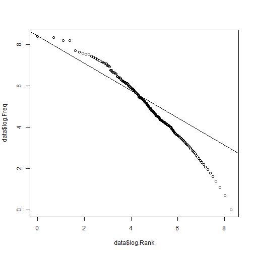
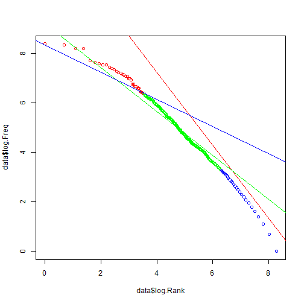

CSC121 Large Assignment 2 Run script 1


```r
source("lga2-defs1.R")
# we can change the words file here
words <- scan("http://www.cs.utoronto.ca/~radford/csc121/pride-and-prejudice.txt","")
# get the data frame with Words, Freq, Rank, Log.Freq, Log,Rank
data <- get_df(words)
m <- lm(log.Rank ~ log.Freq, data = data)
plot(data$log.Rank, data$log.Freq)
abline(m)
```



Then we have the best fitting line for overall frequence and rank


However, due to the constant in the equation, 
and the distribution of data is more likely a normal distribution,
The linear regression does not looks so perfect.


```r
# Set rank devision
r1 <- 3.5
r2 <- 6.3
# plot the overall diagrams
data1 <- data[data$log.Rank < r1,]
m1 <- lm(log.Rank ~ log.Freq, data = data1)
plot(data$log.Rank, data$log.Freq)

# replace the high frequence dots as red dots and then do the best fit line for the linear regression 
points(data1$log.Rank, data1$log.Freq, col="red")
abline(m1, col="red")


# replace the medium frequence data points as green and fitting lines
data2 <- data[data$log.Rank >= r1 & data$log.Rank <= r2,]
m2 <- lm(log.Rank ~ log.Freq, data = data2)
points(data2$log.Rank, data2$log.Freq, col="green")
abline(m2, col="green")


# replace the low frequence data points as blue and fitting lines
data3 <- data[data$log.Rank > r2,]
m3 <- lm(log.Rank ~ log.Freq, data = data3)
points(data3$log.Rank, data3$log.Freq, col="blue")
abline(m3, col="blue")
```



The final result is like that


Due to same reason as the original scattor plot, the constant effects the line we get.
However these are the right lines
