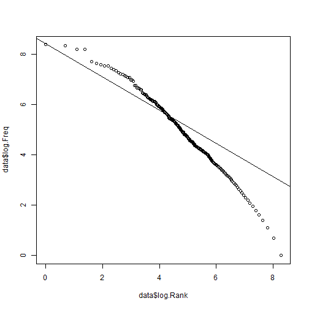
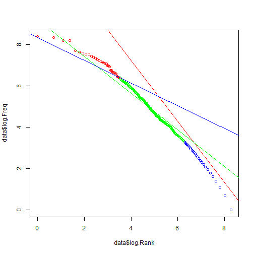

CSC121 Large assignment 2 Run script 2


```r
# Source all processed data and function
source("lga2-defs1.R")
source("lga2-defs2.R")
source("lga2-script1.R")
```



```r
#Produce The halves
half_length <- length(words) %/% 2
first_half <- words[1:half_length]
second_half <- words[(half_length + 1):length(words)]

#Construct the data frames of dfferent halves
data_first_half <- get_df(first_half)
data_second_half <- get_df(second_half)

# Take most common word
get_most_common_word(first_half)
most_common
```

```
## [1] "THE"
```

```r
#First method
prediction<-c(rep(most_common,length(second_half)))
prediction
```

```
##    [1] "THE" "THE" "THE" "THE" "THE" "THE" "THE" "THE" "THE" "THE" "THE"
##   [12] "THE" "THE" "THE" "THE" "THE" "THE" "THE" "THE" "THE" "THE" "THE"
##   [23] "THE" "THE" "THE" "THE" "THE" "THE" "THE" "THE" "THE" "THE" "THE"
##   [34] "THE" "THE" "THE" "THE" "THE" "THE" "THE" "THE" "THE" "THE" "THE"
##   [45] "THE" "THE" "THE" "THE" "THE" "THE" "THE" "THE" "THE" "THE" "THE"
##   [56] "THE" "THE" "THE" "THE" "THE" "THE" "THE" "THE" "THE" "THE" "THE"
##   [67] "THE" "THE" "THE" "THE" "THE" "THE" "THE" "THE" "THE" "THE" "THE"
##   [78] "THE" "THE" "THE" "THE" "THE" "THE" "THE" "THE" "THE" "THE" "THE"
##   [89] "THE" "THE" "THE" "THE" "THE" "THE" "THE" "THE" "THE" "THE" "THE"
##  [100] "THE" "THE" "THE" "THE" "THE" "THE" "THE" "THE" "THE" "THE" "THE"
##  [111] "THE" "THE" "THE" "THE" "THE" "THE" "THE" "THE" "THE" "THE" "THE"
##  [122] "THE" "THE" "THE" "THE" "THE" "THE" "THE" "THE" "THE" "THE" "THE"
##  [133] "THE" "THE" "THE" "THE" "THE" "THE" "THE" "THE" "THE" "THE" "THE"
##  [144] "THE" "THE" "THE" "THE" "THE" "THE" "THE" "THE" "THE" "THE" "THE"
##  [155] "THE" "THE" "THE" "THE" "THE" "THE" "THE" "THE" "THE" "THE" "THE"
##  [166] "THE" "THE" "THE" "THE" "THE" "THE" "THE" "THE" "THE" "THE" "THE"
##  [177] "THE" "THE" "THE" "THE" "THE" "THE" "THE" "THE" "THE" "THE" "THE"
##  [188] "THE" "THE" "THE" "THE" "THE" "THE" "THE" "THE" "THE" "THE" "THE"
##  [199] "THE" "THE" "THE" "THE" "THE" "THE" "THE" "THE" "THE" "THE" "THE"
##  [210] "THE" "THE" "THE" "THE" "THE" "THE" "THE" "THE" "THE" "THE" "THE"
##  [221] "THE" "THE" "THE" "THE" "THE" "THE" "THE" "THE" "THE" "THE" "THE"
##  [232] "THE" "THE" "THE" "THE" "THE" "THE" "THE" "THE" "THE" "THE" "THE"
##  [243] "THE" "THE" "THE" "THE" "THE" "THE" "THE" "THE" "THE" "THE" "THE"
##  [254] "THE" "THE" "THE" "THE" "THE" "THE" "THE" "THE" "THE" "THE" "THE"
##  [265] "THE" "THE" "THE" "THE" "THE" "THE" "THE" "THE" "THE" "THE" "THE"
##  [276] "THE" "THE" "THE" "THE" "THE" "THE" "THE" "THE" "THE" "THE" "THE"
##  [287] "THE" "THE" "THE" "THE" "THE" "THE" "THE" "THE" "THE" "THE" "THE"
##  [298] "THE" "THE" "THE" "THE" "THE" "THE" "THE" "THE" "THE" "THE" "THE"
##  [309] "THE" "THE" "THE" "THE" "THE" "THE" "THE" "THE" "THE" "THE" "THE"
##  [320] "THE" "THE" "THE" "THE" "THE" "THE" "THE" "THE" "THE" "THE" "THE"
##  [331] "THE" "THE" "THE" "THE" "THE" "THE" "THE" "THE" "THE" "THE" "THE"
##  [342] "THE" "THE" "THE" "THE" "THE" "THE" "THE" "THE" "THE" "THE" "THE"
##  [353] "THE" "THE" "THE" "THE" "THE" "THE" "THE" "THE" "THE" "THE" "THE"
##  [364] "THE" "THE" "THE" "THE" "THE" "THE" "THE" "THE" "THE" "THE" "THE"
##  [375] "THE" "THE" "THE" "THE" "THE" "THE" "THE" "THE" "THE" "THE" "THE"
##  [386] "THE" "THE" "THE" "THE" "THE" "THE" "THE" "THE" "THE" "THE" "THE"
##  [397] "THE" "THE" "THE" "THE" "THE" "THE" "THE" "THE" "THE" "THE" "THE"
##  [408] "THE" "THE" "THE" "THE" "THE" "THE" "THE" "THE" "THE" "THE" "THE"
##  [419] "THE" "THE" "THE" "THE" "THE" "THE" "THE" "THE" "THE" "THE" "THE"
##  [430] "THE" "THE" "THE" "THE" "THE" "THE" "THE" "THE" "THE" "THE" "THE"
##  [441] "THE" "THE" "THE" "THE" "THE" "THE" "THE" "THE" "THE" "THE" "THE"
##  [452] "THE" "THE" "THE" "THE" "THE" "THE" "THE" "THE" "THE" "THE" "THE"
##  [463] "THE" "THE" "THE" "THE" "THE" "THE" "THE" "THE" "THE" "THE" "THE"
##  [474] "THE" "THE" "THE" "THE" "THE" "THE" "THE" "THE" "THE" "THE" "THE"
##  [485] "THE" "THE" "THE" "THE" "THE" "THE" "THE" "THE" "THE" "THE" "THE"
##  [496] "THE" "THE" "THE" "THE" "THE" "THE" "THE" "THE" "THE" "THE" "THE"
##  [507] "THE" "THE" "THE" "THE" "THE" "THE" "THE" "THE" "THE" "THE" "THE"
##  [518] "THE" "THE" "THE" "THE" "THE" "THE" "THE" "THE" "THE" "THE" "THE"
##  [529] "THE" "THE" "THE" "THE" "THE" "THE" "THE" "THE" "THE" "THE" "THE"
##  [540] "THE" "THE" "THE" "THE" "THE" "THE" "THE" "THE" "THE" "THE" "THE"
##  [551] "THE" "THE" "THE" "THE" "THE" "THE" "THE" "THE" "THE" "THE" "THE"
##  [562] "THE" "THE" "THE" "THE" "THE" "THE" "THE" "THE" "THE" "THE" "THE"
##  [573] "THE" "THE" "THE" "THE" "THE" "THE" "THE" "THE" "THE" "THE" "THE"
##  [584] "THE" "THE" "THE" "THE" "THE" "THE" "THE" "THE" "THE" "THE" "THE"
##  [595] "THE" "THE" "THE" "THE" "THE" "THE" "THE" "THE" "THE" "THE" "THE"
##  [606] "THE" "THE" "THE" "THE" "THE" "THE" "THE" "THE" "THE" "THE" "THE"
##  [617] "THE" "THE" "THE" "THE" "THE" "THE" "THE" "THE" "THE" "THE" "THE"
##  [628] "THE" "THE" "THE" "THE" "THE" "THE" "THE" "THE" "THE" "THE" "THE"
##  [639] "THE" "THE" "THE" "THE" "THE" "THE" "THE" "THE" "THE" "THE" "THE"
##  [650] "THE" "THE" "THE" "THE" "THE" "THE" "THE" "THE" "THE" "THE" "THE"
##  [661] "THE" "THE" "THE" "THE" "THE" "THE" "THE" "THE" "THE" "THE" "THE"
##  [672] "THE" "THE" "THE" "THE" "THE" "THE" "THE" "THE" "THE" "THE" "THE"
##  [683] "THE" "THE" "THE" "THE" "THE" "THE" "THE" "THE" "THE" "THE" "THE"
##  [694] "THE" "THE" "THE" "THE" "THE" "THE" "THE" "THE" "THE" "THE" "THE"
##  [705] "THE" "THE" "THE" "THE" "THE" "THE" "THE" "THE" "THE" "THE" "THE"
##  [716] "THE" "THE" "THE" "THE" "THE" "THE" "THE" "THE" "THE" "THE" "THE"
##  [727] "THE" "THE" "THE" "THE" "THE" "THE" "THE" "THE" "THE" "THE" "THE"
##  [738] "THE" "THE" "THE" "THE" "THE" "THE" "THE" "THE" "THE" "THE" "THE"
##  [749] "THE" "THE" "THE" "THE" "THE" "THE" "THE" "THE" "THE" "THE" "THE"
##  [760] "THE" "THE" "THE" "THE" "THE" "THE" "THE" "THE" "THE" "THE" "THE"
##  [771] "THE" "THE" "THE" "THE" "THE" "THE" "THE" "THE" "THE" "THE" "THE"
##  [782] "THE" "THE" "THE" "THE" "THE" "THE" "THE" "THE" "THE" "THE" "THE"
##  [793] "THE" "THE" "THE" "THE" "THE" "THE" "THE" "THE" "THE" "THE" "THE"
##  [804] "THE" "THE" "THE" "THE" "THE" "THE" "THE" "THE" "THE" "THE" "THE"
##  [815] "THE" "THE" "THE" "THE" "THE" "THE" "THE" "THE" "THE" "THE" "THE"
##  [826] "THE" "THE" "THE" "THE" "THE" "THE" "THE" "THE" "THE" "THE" "THE"
##  [837] "THE" "THE" "THE" "THE" "THE" "THE" "THE" "THE" "THE" "THE" "THE"
##  [848] "THE" "THE" "THE" "THE" "THE" "THE" "THE" "THE" "THE" "THE" "THE"
##  [859] "THE" "THE" "THE" "THE" "THE" "THE" "THE" "THE" "THE" "THE" "THE"
##  [870] "THE" "THE" "THE" "THE" "THE" "THE" "THE" "THE" "THE" "THE" "THE"
##  [881] "THE" "THE" "THE" "THE" "THE" "THE" "THE" "THE" "THE" "THE" "THE"
##  [892] "THE" "THE" "THE" "THE" "THE" "THE" "THE" "THE" "THE" "THE" "THE"
##  [903] "THE" "THE" "THE" "THE" "THE" "THE" "THE" "THE" "THE" "THE" "THE"
##  [914] "THE" "THE" "THE" "THE" "THE" "THE" "THE" "THE" "THE" "THE" "THE"
##  [925] "THE" "THE" "THE" "THE" "THE" "THE" "THE" "THE" "THE" "THE" "THE"
##  [936] "THE" "THE" "THE" "THE" "THE" "THE" "THE" "THE" "THE" "THE" "THE"
##  [947] "THE" "THE" "THE" "THE" "THE" "THE" "THE" "THE" "THE" "THE" "THE"
##  [958] "THE" "THE" "THE" "THE" "THE" "THE" "THE" "THE" "THE" "THE" "THE"
##  [969] "THE" "THE" "THE" "THE" "THE" "THE" "THE" "THE" "THE" "THE" "THE"
##  [980] "THE" "THE" "THE" "THE" "THE" "THE" "THE" "THE" "THE" "THE" "THE"
##  [991] "THE" "THE" "THE" "THE" "THE" "THE" "THE" "THE" "THE" "THE"
##  [ reached getOption("max.print") -- omitted 60208 entries ]
```

To calculate predictions accuracy of second method


```r
library(MASS)
fractions(length(which(prediction == second_half))/length(second_half))
```

```
## [1] 297/8744
```

So we can get about 3.3% accuracy prediction from this method


```r
#second method
system.time(res<-prediction_of_second(first_half))
```

```
##    user  system elapsed 
##  121.25    0.01  122.16
```

```r
res
```

```
##    [1] "FEELINGS"       "HE"             "BE"             "IN"            
##    [5] "TO"             "BE"             "C"              "AM"            
##    [9] "YOU"            "TO"             "THAT"           "HE"            
##   [13] "AM"             "SURE"           "TO"             "ROOM"          
##   [17] "OF"             "BE"             "IN"             "THE"           
##   [21] "THE"            "AND"            "FOR"            "BE"            
##   [25] "IN"             "AS"             "AM"             "BEEN"          
##   [29] "BE"             "SO"             "ENOUGH"         "THE"           
##   [33] "AND"            "THE"            "AM"             "HER"           
##   [37] "THE"            "AND"            "THE"            "EQUALLY"       
##   [41] "HE"             "AND"            "ME"             "OWN"           
##   [45] "DAUGHTER"       "AND"            "BE"             "THING"         
##   [49] "OF"             "MAN"            "IN"             "THE"           
##   [53] "ROOM"           "AS"             "I"              "IS"            
##   [57] "NOT"            "BE"             "THE"            "ROOM"          
##   [61] "AND"            "THE"            "ROOM"           "WITH"          
##   [65] "THE"            "AND"            "HE"             "AM"            
##   [69] "BEEN"           "THING"          "OF"             "THE"           
##   [73] "OWN"            "OF"             "VERY"           "IN"            
##   [77] "TO"             "AM"             "BEEN"           "HAPPEN"        
##   [81] "HER"            "TO"             "THE"            "WITH"          
##   [85] "THE"            "THE"            "HE"             "AND"           
##   [89] "SHE"            "AM"             "BEEN"           "ROOM"          
##   [93] "OF"             "THE"            "A"              "THE"           
##   [97] "ARE"            "AM"             "NOT"            "AND"           
##  [101] "NO"             "WITH"           "THE"            "WILLIAM"       
##  [105] "AND"            "PERSEVERING"    "RECOMMENDATION" "AND"           
##  [109] "HE"             "REGARD"         "TO"             "BE"            
##  [113] "OWN"            "AND"            "BEEN"           "HIM"           
##  [117] "THE"            "BE"             "VERY"           "AND"           
##  [121] "FROM"           "THE"            "OWN"            "AND"           
##  [125] "HAD"            "OF"             "THE"            "IS"            
##  [129] "TO"             "VERY"           "THAT"           "OF"            
##  [133] "THE"            "HE"             "ROOM"           "TO"            
##  [137] "AND"            "NOT"            "IN"             "THE"           
##  [141] "THE"            "HE"             "AT"             "AM"            
##  [145] "HOW"            "DEAR"           "AND"            "TO"            
##  [149] "THE"            "THE"            "AM"             "NOT"           
##  [153] "YOU"            "THAT"           "HE"             "OWN"           
##  [157] "HAD"            "THE"            "BINGLEY"        "WAS"           
##  [161] "NOT"            "THE"            "SHE"            "AM"            
##  [165] "BEEN"           "BE"             "SUCH"           "THE"           
##  [169] "TO"             "OWN"            "AND"            "AM"            
##  [173] "AND"            "AND"            "SISTER"         "AT"            
##  [177] "THE"            "WERE"           "NOT"            "THE"           
##  [181] "AN"             "THE"            "ANY"            "TO"            
##  [185] "BE"             "I"              "ANY"            "THING"         
##  [189] "OF"             "THE"            "DUTY"           "FOR"           
##  [193] "THE"            "AM"             "AT"             "THAT"          
##  [197] "THE"            "ROOM"           "HAVE"           "THE"           
##  [201] "HE"             "I"              "WAS"            "WITH"          
##  [205] "OWN"            "TO"             "THE"            "OF"            
##  [209] "WAS"            "NOT"            "BE"             "HIM"           
##  [213] "TO"             "THE"            "THING"          "THE"           
##  [217] "THE"            "ELIZABETH"      "HE"             "ARE"           
##  [221] "BEEN"           "BE"             "SO"             "IF"            
##  [225] "AND"            "AM"             "BE"             "BEEN"          
##  [229] "SO"             "THE"            "HOUR"           "AND"           
##  [233] "OWN"            "TO"             "OF"             "THE"           
##  [237] "OWN"            "AND"            "BE"             "HER"           
##  [241] "ROOM"           "OF"             "THAT"           "HE"            
##  [245] "IS"             "IN"             "MUCH"           "HE"            
##  [249] "AM"             "BEEN"           "SO"             "THE"           
##  [253] "THE"            "A"              "AND"            "BE"            
##  [257] "GAVE"           "TO"             "THE"            "SISTER"        
##  [261] "OWN"            "AGAINST"        "BEEN"           "BE"            
##  [265] "SO"             "ADMIRATION"     "I"              "AM"            
##  [269] "BE"             "BE"             "TO"             "BE"            
##  [273] "THAT"           "HE"             "ROOM"           "OF"            
##  [277] "THE"            "OWN"            "AND"            "AND"           
##  [281] "THE"            "AND"            "NOT"            "A"             
##  [285] "TO"             "BE"             "BEEN"           "HIM"           
##  [289] "ROOM"           "AGREEABLE"      "THE"            "THE"           
##  [293] "VERY"           "THAT"           "HE"             "TO"            
##  [297] "AND"            "SISTER"         "AND"            "SISTER"        
##  [301] "AND"            "NOT"            "BE"             "TO"            
##  [305] "BE"             "IN"             "ACCOUNT"        "AND"           
##  [309] "HE"             "AM"             "NOT"            "OF"            
##  [313] "THE"            "THAT"           "SISTER"         "AND"           
##  [317] "A"              "THAT"           "I"              "AM"            
##  [321] "NOT"            "NEAR"           "BE"             "THAT"          
##  [325] "HE"             "DEAR"           "THE"            "THE"           
##  [329] "THE"            "NOT"            "BE"             "MET"           
##  [333] "THE"            "THE"            "DEAR"           "OF"            
##  [337] "OTHER"          "A"              "AM"             "NOT"           
##  [341] "BE"             "IT"             "SISTER"         "BE"            
##  [345] "IN"             "AND"            "HE"             "AM"            
##  [349] "TO"             "IS"             "AM"             "THAT"          
##  [353] "IS"             "THE"            "BUT"            "THAT"          
##  [357] "TO"             "AMIABLE"        "TO"             "AM"            
##  [361] "TO"             "IS"             "THE"            "FOR"           
##  [365] "DEAR"           "AGAINST"        "BE"             "ROOM"          
##  [369] "AND"            "NOT"            "BE"             "TO"            
##  [373] "WHO"            "HE"             "AM"             "NIGHT"         
##  [377] "AND"            "THAT"           "BE"             "BEEN"          
##  [381] "A"              "ROOM"           "CIVILITY"       "HER"           
##  [385] "THE"            "I"              "BE"             "AN"            
##  [389] "HER"            "THE"            "DEAR"           "AND"           
##  [393] "IS"             "ROOM"           "OF"             "THE"           
##  [397] "AS"             "NOT"            "BE"             "IN"            
##  [401] "MUCH"           "DEAL"           "HOUR"           "BUT"           
##  [405] "BE"             "DEAR"           "MR"             "TO"            
##  [409] "BE"             "TO"             "I"              "WAS"           
##  [413] "NOT"            "OF"             "OR"             "THE"           
##  [417] "THE"            "OR"             "HE"             "I"             
##  [421] "MORE"           "THE"            "THE"            "THE"           
##  [425] "BE"             "HOUR"           "TO"             "OF"            
##  [429] "THE"            "AND"            "I"              "AM"            
##  [433] "BEEN"           "TO"             "TO"             "BE"            
##  [437] "THAT"           "HE"             "WERE"           "NOT"           
##  [441] "BE"             "AND"            "THE"            "TO"            
##  [445] "WORDS"          "OR"             "BE"             "IN"            
##  [449] "THE"            "I"              "THESE"          "ROOM"          
##  [453] "IN"             "THE"            "OWN"            "THOUGHTS"      
##  [457] "AND"            "I"              "IF"             "NOT"           
##  [461] "TO"             "THE"            "WITH"           "THE"           
##  [465] "HE"             "IGNORANCE"      "OF"             "THE"           
##  [469] "NOT"            "MUCH"           "BEEN"           "MUCH"          
##  [473] "EVERY"          "CHARMING"       "THE"            "THE"           
##  [477] "AND"            "THE"            "OWN"            "MILES"         
##  [481] "SISTERS"        "AND"            "THE"            "FOR"           
##  [485] "TO"             "THE"            "OWN"            "AND"           
##  [489] "FOR"            "TO"             "IS"             "THE"           
##  [493] "TO"             "BE"             "ME"             "ARE"           
##  [497] "I"              "THE"            "OWN"            "AND"           
##  [501] "THE"            "ROOM"           "OF"             "THE"           
##  [505] "OWN"            "THE"            "ALL"            "THE"           
##  [509] "OWN"            "AGAINST"        "THE"            "IS"            
##  [513] "OF"             "THE"            "TO"             "ME"            
##  [517] "IS"             "ME"             "ARE"            "TO"            
##  [521] "BE"             "IT"             "HE"             "BE"            
##  [525] "BEEN"           "THE"            "THE"            "MUCH"          
##  [529] "TO"             "BE"             "A"              "THING"         
##  [533] "OF"             "THE"            "ROOM"           "HER"           
##  [537] "OF"             "A"              "OF"             "MEANS"         
##  [541] "THAN"           "BRINGS"         "HER"            "THE"           
##  [545] "ARE"            "THE"            "OWN"            "DAUGHTER"      
##  [549] "AND"            "SHE"            "IS"             "A"             
##  [553] "AND"            "BE"             "ROOM"           "OF"            
##  [557] "THE"            "A"              "THE"            "AND"           
##  [561] "AM"             "NOT"            "TO"             "THAT"          
##  [565] "AND"            "HE"             "THE"            "SHE"           
##  [569] "AWAY"           "HE"             "AND"            "DEAR"          
##  [573] "OF"             "THE"            "THE"            "AND"           
##  [577] "NOT"            "HIS"            "THE"            "BODY"          
##  [581] "MY"             "COLOUR"         "HE"             "NOT"           
##  [585] "BEEN"           "HIM"            "TO"             "THE"           
##  [589] "BE"             "THE"            "DEAR"           "MR"            
##  [593] "THE"            "SHE"            "AM"             "ACCOMPLISHED"  
##  [597] "VERY"           "AGREEABLE"      "ABOUT"          "AS"            
##  [601] "HAD"            "THE"            "AND"            "THE"           
##  [605] "AND"            "THE"            "ROOM"           "BEFORE"        
##  [609] "DAY"            "TO"             "ARE"            "AM"            
##  [613] "SURE"           "THAT"           "THAT"           "THE"           
##  [617] "ROOM"           "OF"             "THE"            "AS"            
##  [621] "NO"             "ROOM"           "OF"             "HE"            
##  [625] "AM"             "THERE"          "A"              "AND"           
##  [629] "BE"             "IN"             "ABOUT"          "OWN"           
##  [633] "AND"            "AND"            "BEEN"           "SO"            
##  [637] "CAPABLE"        "BY"             "THE"            "DEAR"          
##  [641] "AND"            "GIRLS"          "THE"            "THE"           
##  [645] "OF"             "NOT"            "AS"             "BY"            
##  [649] "THE"            "OF"             "OF"             "HE"            
##  [653] "MEANS"          "TO"             "NOT"            "BE"            
##  [657] "IN"             "ALL"            "THE"            "THE"           
##  [661] "OWN"            "AND"            "ARE"            "AFTER"         
##  [665] "TO"             "THE"            "IN"             "TO"            
##  [669] "TO"             "THE"            "AND"            "ARE"           
##  [673] "SHE"            "AWAY"           "THE"            "WAS"           
##  [677] "AM"             "ASSENTED"       "TO"             "THE"           
##  [681] "ROOM"           "AS"             "THE"            "OUT"           
##  [685] "OF"             "BE"             "DEAR"           "MR"            
##  [689] "ROOM"           "THAT"           "IS"             "THE"           
##  [693] "A"              "VERY"           "OF"             "AM"            
##  [697] "THE"            "THE"            "THE"            "TO"            
##  [701] "AND"            "I"              "TO"             "IS"            
##  [705] "THE"            "BE"             "BEEN"           "THE"           
##  [709] "OTHER"          "A"              "OWN"            "NEVER"         
##  [713] "AM"             "NOT"            "BE"             "THAT"          
##  [717] "HE"             "IS"             "BE"             "THE"           
##  [721] "BEEN"           "HER"            "ROOM"           "AND"           
##  [725] "BEEN"           "IS"             "BE"             "SO"            
##  [729] "THE"            "THE"            "ROOM"           "OF"            
##  [733] "HE"             "AM"             "THE"            "BE"            
##  [737] "THE"            "HER"            "THE"            "OWN"           
##  [741] "AND"            "AND"            "HAD"            "BEEN"          
##  [745] "THE"            "THAT"           "SISTER"         "BE"            
##  [749] "TO"             "OWN"            "FOR"            "THE"           
##  [753] "I"              "HE"             "BE"             "THE"           
##  [757] "TO"             "FOR"            "I"              "AND"           
##  [761] "BEEN"           "DEAL"           "AND"            "AND"           
##  [765] "THE"            "VERY"           "IMPULSES"       "IN"            
##  [769] "THE"            "DEAR"           "ALONE"          "SHE"           
##  [773] "THE"            "OWN"            "AND"            "BE"            
##  [777] "HER"            "TO"             "I"              "HE"            
##  [781] "HAD"            "BEEN"           "IN"             "TO"            
##  [785] "NOT"            "MEANS"          "WELL"           "TO"            
##  [789] "OF"             "BE"             "HER"            "TO"            
##  [793] "THE"            "NO"             "THE"            "AND"           
##  [797] "THE"            "HE"             "THAT"           "BEEN"          
##  [801] "SO"             "HIM"            "NOT"            "EVER"          
##  [805] "ROOM"           "IN"             "THE"            "VERY"          
##  [809] "AT"             "AM"             "BE"             "AND"           
##  [813] "TO"             "THE"            "BEEN"           "IT"            
##  [817] "BEGAN"          "AS"             "WAS"            "A"             
##  [821] "I"              "OF"             "OF"             "THE"           
##  [825] "DEAR"           "BUT"            "THE"            "ROOM"          
##  [829] "PARTY"          "AS"             "THE"            "HE"            
##  [833] "AM"             "NOT"            "BE"             "NO"            
##  [837] "THE"            "IN"             "IS"             "A"             
##  [841] "HE"             "AM"             "TO"             "BE"            
##  [845] "IT"             "ROOM"           "TAKEN"          "THE"           
##  [849] "UNDOUBTEDLY"    "MUCH"           "FROM"           "TO"            
##  [853] "BE"             "BY"             "THE"            "TO"            
##  [857] "OWN"            "AND"            "IN"             "THE"           
##  [861] "AND"            "AM"             "NOT"            "IS"            
##  [865] "TO"             "TO"             "IS"             "NOT"           
##  [869] "AS"             "BE"             "BINGLEY"        "AND"           
##  [873] "I"              "SISTER"         "AND"            "A"             
##  [877] "TO"             "IT"             "LIKE"           "THE"           
##  [881] "IS"             "HE"             "WERE"           "BE"            
##  [885] "BEEN"           "WITH"           "ANY"            "OF"            
##  [889] "OF"             "A"              "YOU"            "THAT"          
##  [893] "I"              "OWN"            "FOR"            "NOT"           
##  [897] "BE"             "TO"             "BE"             "TO"            
##  [901] "TO"             "THE"            "THE"            "TO"            
##  [905] "BE"             "HER"            "SISTER"         "ANY"           
##  [909] "TIME"           "OF"             "YOU"            "IS"            
##  [913] "THE"            "IS"             "NO"             "NOT"           
##  [917] "MY"             "TO"             "IS"             "A"             
##  [921] "IT"             "TO"             "THE"            "IS"            
##  [925] "NOT"            "IT"             "THE"            "ROOM"          
##  [929] "OF"             "THE"            "IS"             "OF"            
##  [933] "AM"             "BEEN"           "TO"             "THAN"          
##  [937] "BE"             "THAT"           "MEANS"          "OF"            
##  [941] "FOR"            "BE"             "OF"             "HE"            
##  [945] "AM"             "BEEN"           "A"              "OWN"           
##  [949] "AND"            "AND"            "IS"             "NOT"           
##  [953] "THE"            "IT"             "THE"            "I"             
##  [957] "ROOM"           "FOR"            "HE"             "BY"            
##  [961] "TO"             "BE"             "BE"             "ARE"           
##  [965] "WELL"           "FLOW"           "TO"             "TO"            
##  [969] "AM"             "BEEN"           "BE"             "IT"            
##  [973] "ABOUT"          "BE"             "HIM"            "TO"            
##  [977] "THE"            "TO"             "BE"             "HE"            
##  [981] "OF"             "THAN"           "THE"            "THE"           
##  [985] "THE"            "BEEN"           "A"              "DARCY"         
##  [989] "AND"            "AM"             "YOU"            "TO"            
##  [993] "THE"            "IS"             "THE"            "IT"            
##  [997] "THE"            "ARE"            "ROOM"           "PARTY"         
##  [ reached getOption("max.print") -- omitted 60208 entries ]
```

To calculate predictions accuracy of second method


```r
fractions(length(which(res == second_half))/length(second_half))
```

```
## [1] 1007/8744
```

So we can get about 11% accuracy prediction from method
instead of 3.3% just replacing all with the common word.
